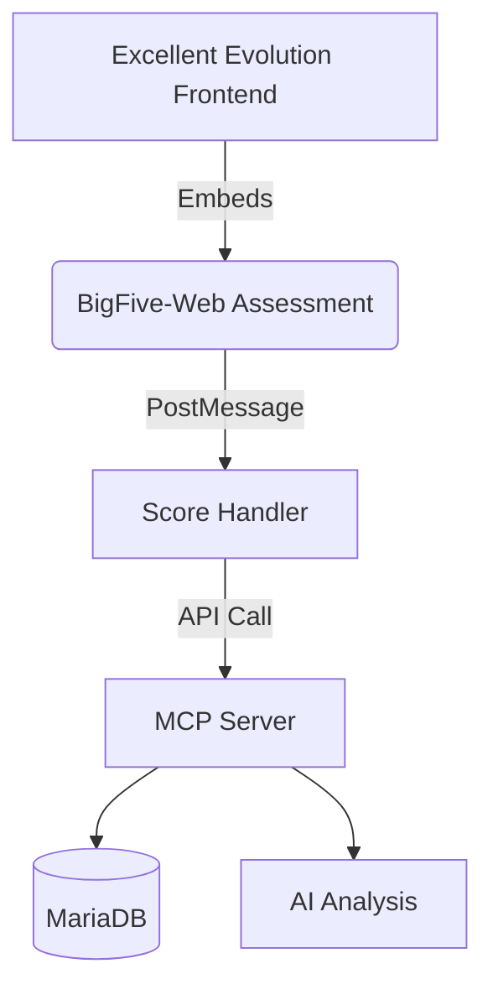

# BigFive-Web Integration Plan

## Architecture Overview



## Implementation Components

### 1. Frontend Integration

```tsx
// components/assessments/BigFiveTest.tsx
import { useAuth } from "@clerk/nextjs";

export function BigFiveTest() {
  const { userId } = useAuth();
  
  return (
    <iframe 
      src={`${BIGFIVE_URL}?user=${userId}`}
      onMessage={handleMessage}
      className="w-full h-screen"
    />
  );
}
```

### 2. Communication Layer

```ts
// lib/assessment-handler.ts
interface BigFiveScores {
  openness: number;
  conscientiousness: number;
  extraversion: number;
  agreeableness: number;
  neuroticism: number;
}

const handleMessage = (event: MessageEvent) => {
  if (event.origin !== BIGFIVE_URL) return;
  
  const scores = validateScores(event.data);
  if (scores) {
    submitScores(scores);
  }
};
```

## API Specification

### POST `/api/assessments/bigfive`

**Request:**
```json
{
  "userId": "clerk_123",
  "scores": {
    "openness": 0.82,
    "conscientiousness": 0.65,
    "extraversion": 0.71,
    "agreeableness": 0.59,
    "neuroticism": 0.43
  }
}
```

**Response:**
```json
{
  "success": true,
  "analysisId": "uuid_123"
}
```

## Database Schema

```sql
CREATE TABLE bigfive_scores (
  id VARCHAR(36) PRIMARY KEY,
  user_id VARCHAR(36) NOT NULL,
  openness DECIMAL(3,2),
  conscientiousness DECIMAL(3,2),
  extraversion DECIMAL(3,2),
  agreeableness DECIMAL(3,2),
  neuroticism DECIMAL(3,2),
  created_at TIMESTAMP DEFAULT CURRENT_TIMESTAMP,
  FOREIGN KEY (user_id) REFERENCES users(id)
);
```

## Security Measures

1. **Content Security Policy:**
   ```ts
   // next.config.js
   headers: () => [{
     source: '/(.*)',
     headers: [{
       key: 'Content-Security-Policy',
       value: `frame-src ${BIGFIVE_URL}`
     }]
   }]
   ```

2. **Data Validation:**
   ```ts
   function validateScores(data: unknown): BigFiveScores | null {
     // Type guard implementation
   }
   ```

## Testing Strategy

| Test Type | Tools | Coverage |
|-----------|-------|----------|
| Unit Tests | Jest | Score transformation |
| Integration | Cypress | Full user flow |
| Security | OWASP ZAP | XSS/CSRF |

## Deployment Checklist

1. [ ] Configure CSP headers
2. [ ] Deploy API endpoint
3. [ ] Create database table
4. [ ] Set up monitoring
5. [ ] Document API spec

## Timeline

1. Development: 2 weeks
2. Testing: 1 week
3. Staging: 3 days
4. Production: 1 day rollout

*Last Updated: ${new Date().toISOString()}*