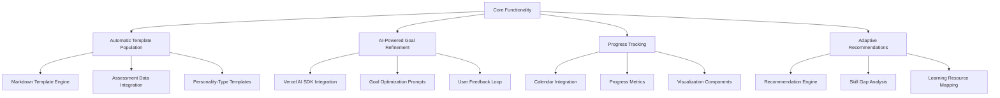

# AI-Powered Professional Development Coaching Application

## I. Project Overview

### Vision
AI-powered coaching platform for comprehensive professional development through personalized career roadmaps and intelligent coaching insights (aligned with productContext.md)

## II. Technical Architecture

### Technology Stack
- **Frontend**: Next.js 15 (App Router)
- **Language**: TypeScript 5.3
- **State Management**: Zustand + React-Query
- **Authentication**: Clerk.com (OAuth)
- **AI Integration**: Vercel AI SDK with Sonnet 3.7 LLM
- **Database**: MariaDB 11.3 (Local)

### Project Structure
```
coaching-app/
│
├── src/
│   ├── app/
│   │   ├── (auth)/
│   │   ├── (dashboard)/
│   │   ├── (coaching)/
│   │   │   └── chat/
│   │   │       └── page.tsx  # New chat page
│   │   ├── api/
│   │   │   └── ai/
│   │   │       └── chat/
│   │   │           └── route.ts # New chat API route
│   │   └── layout.tsx
│   │
│   ├── components/
│   │   ├── ui/
│   │   ├── development-plan/
│   │   ├── assessments/
│   │   └── coaching/
│   │       └── AIChatInterface.tsx # New chat UI component
│   │
│   ├── lib/
│   │   ├── database/
│   │   ├── ai/
│   │   ├── utils/
│   │   └── markdown-generator/
│   │
│   ├── hooks/
│   │   ├── useDevPlan.ts
│   │   ├── useAssessments.ts
│   │   └── useAIRecommendations.ts # Renamed/Created hook for AI chat
│   │
│   └── types/
│       ├── development-plan.ts
│       ├── assessments.ts
│       └── coaching.ts
│
└── .env.local
```

## III. Core Features and Modules

### 1. User Authentication and Onboarding
- Clerk.com authentication (OAuth, email, social login support)
- Comprehensive user profile creation
- Initial assessment workflow
- Session-based middleware implementation

**Status:** Authentication layer with Clerk.com integration, middleware, and session management is complete.

#### Onboarding Assessment Components
- Personality & Career Assessments
  - Big Five (OCEAN)
  - 16PF (optional)
  - Holland Code (RIASEC)
  - DiSC
  - TalentSmartEQ EI Appraisal
  - Career Values Scale
- Professional Context Capture
- Career Aspiration Mapping

### 2. Professional Development Plan Generator
#### Key Capabilities
- Dynamic Markdown document generation (context-aware templates)
- AI-assisted goal refinement with personality integration
- Quarterly review system with progress tracking
- Adaptive skill development roadmap

#### Core Functionality
- Automatic template population
- AI-powered goal refinement
- Progress tracking
- Adaptive recommendations

### 3. AI Coaching Assistant
- Natural language interactions
- Contextual career advice
- Personalized development strategies
- Quarterly review analysis

**Status:** Basic natural language interaction via chat interface implemented using Vercel AI SDK (`useChat` hook, API route, Anthropic Sonnet 3.7). Contextual advice, personalized strategies, and review analysis are pending integration.
## IV. Database Schema (MariaDB)

```sql
-- Users Table
CREATE TABLE users (
  id CHAR(36) PRIMARY KEY DEFAULT UUID(),
  email VARCHAR(255) UNIQUE NOT NULL,
  email_verified DATETIME(6),
  verification_token VARCHAR(255),
  full_name VARCHAR(255),
  profile_data JSON,
  assessment_results JSON,
  created_at DATETIME(6) DEFAULT CURRENT_TIMESTAMP(6),
  last_coached_at DATETIME(6),
  personality_type VARCHAR(4),
  INDEX idx_personality_type (personality_type)
);

-- Development Plans Table
CREATE TABLE development_plans (
  id CHAR(36) PRIMARY KEY DEFAULT UUID(),
  user_id CHAR(36) NOT NULL,
  plan_version VARCHAR(20) NOT NULL,
  career_stage ENUM('early', 'mid', 'executive') NOT NULL,
  personality_type VARCHAR(4) NOT NULL,
  short_term_goals JSON,
  long_term_objectives JSON,
  skill_development_roadmap JSON,
  quarterly_focus JSON,
  created_at DATETIME(6) DEFAULT CURRENT_TIMESTAMP(6),
  last_updated DATETIME(6),
  FOREIGN KEY (user_id) REFERENCES users(id)
);

-- Coaching Sessions Table
CREATE TABLE coaching_sessions (
  id CHAR(36) PRIMARY KEY DEFAULT UUID(),
  user_id CHAR(36) NOT NULL,
  session_date DATETIME(6) NOT NULL,
  session_type ENUM('quarterly', 'annual') NOT NULL,
  ai_transcript TEXT,
  key_insights JSON,
  recommended_actions JSON,
  FOREIGN KEY (user_id) REFERENCES users(id)
);
```

## V. Development Workflow

### Phase 1: Foundation and Authentication
- Set up Next.js project
- Configure MariaDB 11.3 with Knex.js query builder
- Implement NextAuth Magic Link flow
- Create migration for auth schema:
  ```sql
  CREATE TABLE verification_tokens (
    identifier TEXT NOT NULL,
    expires DATETIME(6) NOT NULL,
    token TEXT NOT NULL PRIMARY KEY
  );

  CREATE INDEX idx_verification_token ON verification_tokens (token);
  ```
- Implement session-based middleware
- Add session callback for user metadata

### Phase 2: Assessment and Profiling
- Develop personality assessment modules
- Create input interfaces
- Implement assessment result processing
- Build initial AI analysis capabilities

### Phase 3: Development Plan Generation
- Create markdown generation module
- Develop AI-assisted goal setting
- Implement quarterly review mechanisms
- Build progress tracking system

### Phase 4: AI Coaching Assistant
- Integrate AI API (✅ Basic chat API route created)
- Develop conversation flow (✅ Basic `useChat` flow implemented)
- Create context-aware recommendation system
- Implement natural language processing

### Phase 5: Dashboard and Visualizations
- Design progress tracking UI
- Implement data visualization
- Create personalized insights display
- Develop reporting mechanisms

## VI. AI Integration Strategies

### Personality and Goal Analysis
- Deep analysis of assessment results via Vercel AI SDK
- Contextual goal recommendation with Sonnet 3.7 LLM
- Personalized development pathway generation

### Continuous Learning Approaches
- Vercel AI SDK-powered adaptive recommendation engine
- Quarterly goal refinement with AI-assisted insights
- Proactive skill gap identification through LLM analysis

## VII. Ethical and Technical Considerations

### Data Privacy and Security
- End-to-end encryption
- Anonymized data processing
- Transparent data usage policies

### AI Bias Mitigation
- Diverse training data
- Regular model evaluation
- Inclusive recommendation strategies

## VIII. Potential Challenges and Mitigations

### Technical Challenges
- AI Response Consistency
- Complex Recommendation Generation
- Performance Optimization

### Mitigation Strategies
- Advanced prompt engineering
- Modular AI integration
- Robust error handling
- Continuous model refinement

## IX. Future Expansion Roadmap

### Short-Term Enhancements
- Mobile application development
- Advanced analytics
- Enhanced AI coaching capabilities

### Long-Term Vision
- Community coaching features
- Global professional network integration
- Advanced machine learning models

## X. Implementation Milestones

### Milestone 1: MVP Development
- Clerk.com authentication
- Initial assessment module
- Development plan generation with Vercel AI SDK

### Milestone 2: AI Coaching
- Vercel AI SDK integration with Sonnet 3.7 (✅ Basic chat implemented)
- Personalized LLM recommendations
- Quarterly review mechanisms

### Milestone 3: Advanced Features
- Mobile-responsive UI
- Data visualization dashboards
- Community features with secure MCP access

## XI. Recommended Action Steps

1. Database Setup
   ```bash
   npm install @prisma/client
   npx prisma generate
   ```
2. Clerk.com Configuration
3. Vercel AI SDK Installation (✅ Core `ai`, `@ai-sdk/anthropic`, `@anthropic-ai/sdk` installed)
4. Secure MCP Middleware
5. Assessment Module Creation
6. Vercel AI SDK Integration (✅ Basic chat API and hook implemented)
7. Development Plan Generator
8. Dashboard Components
9. End-to-End Testing
10. Memory Bank Updates

## XII. Resource Requirements

### Technical Resources
- Next.js Developers
- TypeScript Experts
- AI Integration Specialists
- UX/UI Designers
- DevOps Engineers

### Tools and Platforms
- Development Environments
- AI API Access
- Cloud Hosting
- Monitoring and Analytics Tools

## XIII. Implementation Plan



### Phase Implementation Details

1. **Automatic Template Population**
   - Enhance Markdown template engine
   - Implement version control system
   - Create assessment data mapping service

2. **AI-Powered Goal Refinement**
   - Develop Vercel AI SDK service
   - Create prompt engineering system
   - Implement feedback capture component

3. **Progress Tracking**
   - Update database schema
   - Implement calendar integration
   - Build visualization components

4. **Adaptive Recommendations**
   - Develop recommendation scoring algorithm
   - Create resource database
   - Build adaptive UI components

## XIV. Risk Mitigation

| Risk | Probability | Impact | Mitigation Strategy |
|------|-------------|--------|---------------------|
| AI response inconsistency | Medium | High | Implement response validation layer |
| Calendar sync latency | Low | Medium | Use background workers |
| Template version conflicts | High | Medium | Add Git-like version control |
| Mobile rendering issues | Medium | High | Rigorous cross-device testing |

## XV. File Updates Required

1. `frontend/src/lib/markdown-generator.ts`
   - Add template merging functionality
   - Implement version control system

2. `frontend/src/hooks/useAIRecommendations.ts` (✅ Created)
   - Implements basic chat interaction using Vercel AI SDK `useChat`.
   - Future enhancements: Add functions for specific coaching actions (e.g., `refineGoals`, `analyzeReview`).

3. `prisma/schema.prisma`
   - Add progress tracking fields:
   ```prisma
   model DevelopmentPlan {
     // Existing fields
     progress_metrics Json
     last_ai_refinement DateTime
     resource_recommendations Json
   }
   ```
4. `frontend/src/components/coaching/AIChatInterface.tsx` (✅ Created)
   - Provides the UI for the AI chat.
5. `frontend/src/app/(coaching)/chat/page.tsx` (✅ Created)
   - Renders the `AIChatInterface` component at the `/chat` route.
6. `frontend/src/app/api/ai/chat/route.ts` (✅ Created)
   - Handles backend communication with Anthropic via Vercel AI SDK `streamText`.

## XVI. Phase Completion Checklist

- [✅] Basic AI Chat API Route (`/api/ai/chat`)
- [✅] Basic AI Chat Frontend Hook (`useAIRecommendations`)
- [✅] Basic AI Chat UI Component (`AIChatInterface`)
- [✅] Basic AI Chat Page (`/chat`)
- [ ] Template engine enhancements
- [ ] AI refinement service integration (for Dev Plans)
- [ ] AI Coaching context integration (assessments, plans)
- [ ] Progress tracking dashboard
- [ ] Recommendation engine implementation
- [ ] End-to-end testing plan
- [✅] Memory bank documentation updates (Initial pass complete)
---
*Project Plan Updated with Implementation Details*
*Last Updated: 2025-04-07 (Added AI Chat basic implementation)*
