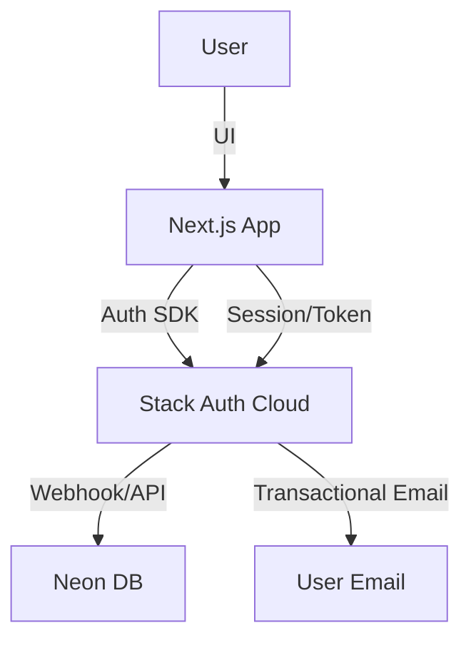

# Stack Auth Integration Plan for User Authentication

## 1. Overview

Replace NextAuth.js with Stack Auth for user authentication, social login, and transactional email, fully integrated with Neon (Postgres) and Vercel. Ensure secure, scalable, and cloud-native auth for both local and production environments.

---

## 2. High-Level Steps

### 2.1. Preparation
- Review current NextAuth.js usage (API routes, session management, user model).
- Choose a Stack Auth provider (e.g., Stytch, Clerk, Auth0, etc.).
- Create a Stack Auth account and register your application.
- Gather API keys, client IDs, and callback URLs.

### 2.2. Install Stack Auth SDK
- Add the Stack Auth SDK to your Next.js project:
  ```bash
  npm install @clerk/clerk-react # or the relevant SDK for your provider
  ```
- Remove NextAuth.js dependencies.

### 2.3. Configure Environment Variables
- Add Stack Auth API keys and secrets to `.env.local` and Vercel project settings.
- Add Neon DB connection string if not already present.

### 2.4. Integrate Stack Auth UI Components
- Replace NextAuth.js UI (sign-in, sign-up, profile) with Stack Auth components.
- Update your app’s layout to include Stack Auth’s provider/wrapper.
- Ensure proper routing for auth pages (e.g., `/sign-in`, `/sign-up`, `/profile`).

### 2.5. Backend Integration & User Sync
- Implement webhook or API handler to sync user data from Stack Auth to Neon on registration/login.
- Create or update the `users` table in Neon to match Stack Auth’s user model.
- Update protected API routes and middleware to use Stack Auth’s session validation.

### 2.6. Transactional Email
- Configure transactional email in Stack Auth (sender domain, templates).
- Update password reset, verification, and notification flows to use Stack Auth’s email API.

### 2.7. Testing & Validation
- Test registration, login, logout, and session flows locally and in preview deploys.
- Verify user data syncs to Neon.
- Test transactional email delivery.
- Remove all remaining NextAuth.js code and configs.

### 2.8. Rollback & Contingency
- Keep NextAuth.js code in a separate branch until Stack Auth is fully validated.
- Use feature flags or environment variables to toggle between auth providers during migration.

---

## 3. Architecture Diagram



---

## 4. Next Steps

1. Confirm Stack Auth provider and register the app.
2. Install SDK and configure environment variables.
3. Integrate UI and backend sync.
4. Test all flows and deploy to preview/production.
5. Remove legacy auth code.