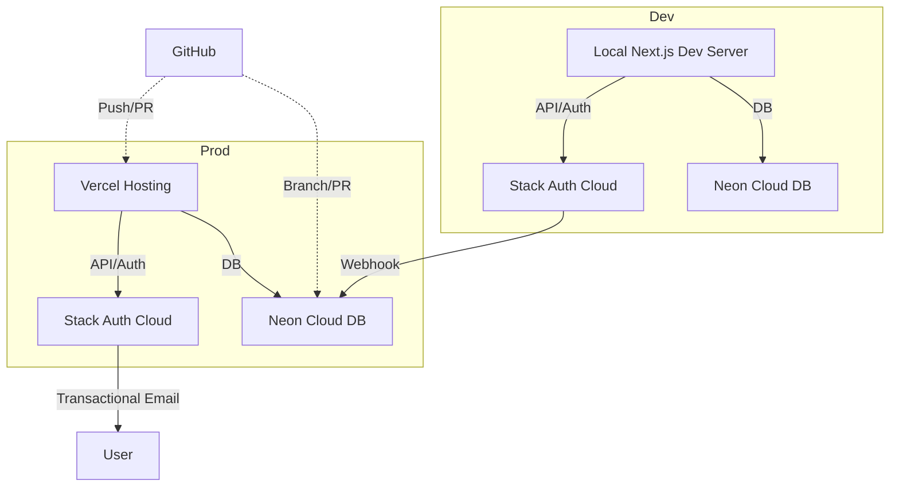

# Migration & Integration Plan: Neon + Stack Auth + Vercel + GitHub

## 1. Overview

You will migrate to a modern, cloud-native stack:
- **Database:** Neon (serverless Postgres, GitHub integration, branching)
- **Authentication & Email:** Stack Auth (auth, user management, transactional email)
- **Hosting:** Vercel (Next.js optimized, GitHub integration, preview deploys)
- **Source Control:** GitHub (CI/CD, code review, branch-based workflows)
- **Local Dev:** Use cloud services for DB/auth, local Vercel dev server

---

## 2. High-Level Architecture

---

## 3. Step-by-Step Plan

### 3.1. Set Up Neon (Database)

1. **Create Neon Account** (https://neon.tech, use GitHub SSO for free-tier benefits). Done
2. **Create a Project & Database** (choose region close to your users). Done
3. **Enable GitHub Integration**:
   - Connect Neon to your GitHub repo for branch-based preview DBs. Done
   - Configure automatic DB branching for PRs if desired. Done
4. **Migrate Schema**:
   - Export your current Postgres schema only (no data) using:
     `pg_dump -h localhost -U coaching_app_user -d professional_coaching_db -s -f schema.sql`
   - Import the schema into Neon (via Neon dashboard or CLI).
   - Update your ORM config (e.g., Prisma) with Neon’s connection string (use SSL).
   - *Note: If you add data in the future, you can repeat this process with a full export/import.*
5. **Set Up Roles & Security**:
   - Create separate DB users for dev/prod.
   - Enable SSL and restrict access as needed.

### 3.2. Set Up Stack Auth (Authentication & Email)

> **See also:** [Stack Auth Integration Plan](cline_docs/stack-auth-integration-plan.md) for a detailed step-by-step guide.

1. **Create Stack Auth Account** (e.g., Stytch, Clerk, or similar).
2. **Configure Application**:
   - Register your app (set callback URLs for local and Vercel).
   - Enable transactional email (configure sender domain, templates).
   - Set up social login providers if needed.
3. **Sync Users to Neon**:
   - Use Stack Auth webhooks or API to sync user data to Neon on registration/login.
   - Create a `users` table in Neon if not present.
   - Implement webhook handler in your Next.js API routes.
4. **Configure Environment Variables**:
   - Add Stack Auth API keys/secrets to Vercel and local `.env`.
   - Add Neon DB connection string to Vercel and local `.env`.

### 3.3. Set Up Vercel (Hosting)

1. **Create Vercel Account** (https://vercel.com, use GitHub SSO).
2. **Import Your GitHub Repo**:
   - Connect your repo to Vercel.
   - Set up environment variables for Neon and Stack Auth.
   - Configure build settings for Next.js 14/15.
3. **Enable Preview Deploys**:
   - Each PR triggers a preview deploy.
   - (Optional) Use Neon’s branch-based DB previews for each PR.
4. **Set Up Custom Domain** (if needed, free SSL included).

### 3.4. Local Development Workflow

1. **Use Cloud Neon DB for Local Dev**:
   - Use a separate Neon branch or database for local development.
   - Add the Neon dev connection string to your local `.env`.
2. **Use Stack Auth for Local Auth**:
   - Configure Stack Auth to allow localhost callback URLs.
   - Use the same API keys as production or a separate dev project.
3. **Run Next.js Locally**:
   - Use `vercel dev` or `next dev` for local development.
   - Ensure all environment variables are set in `.env.local`.

### 3.5. Update Project Codebase

1. **Update ORM Config** (e.g., Prisma):
   - Change the database URL to Neon.
   - Run migrations against Neon.
2. **Replace NextAuth.js with Stack Auth**:
   - Remove NextAuth.js code and dependencies.
   - Integrate Stack Auth SDK and UI components.
   - Implement user sync to Neon via webhook/API.
   - Update all auth-related API routes and middleware.
3. **Implement Transactional Email**:
   - Use Stack Auth’s transactional email API for user notifications, password resets, etc.
   - Update email templates as needed.

### 3.6. Testing & Validation

1. **Test Local Development**:
   - Register/login users, check DB sync, test transactional emails.
2. **Test Preview Deploys**:
   - Open PR, verify Vercel deploy, Neon branch, and Stack Auth integration.
3. **Test Production Deploy**:
   - Merge to main, verify production deploy, DB, and auth.
4. **Monitor Logs & Errors**:
   - Use Vercel, Neon, and Stack Auth dashboards for monitoring.

---

## Related Documentation

- [Stack Auth Integration Plan](cline_docs/stack-auth-integration-plan.md): Step-by-step instructions for implementing Stack Auth authentication in this project.

---

## 4. Free-Tier Maximization Tips

- Use GitHub SSO for all services to unlock free-tier benefits.
- Use Neon’s free branching and storage limits.
- Use Vercel’s free preview deploys and bandwidth.
- Use Stack Auth’s free tier for auth and transactional email (watch for monthly limits).

---

## 5. Rollback & Contingency

- Keep your old Postgres and NextAuth.js setup until the new stack is fully validated.
- Use feature flags or environment variables to toggle between old and new services during migration.

---

## 6. Documentation & Next Steps

- Document all environment variables and secrets.
- Update onboarding docs for new devs.
- Plan for future scaling (paid tiers, custom domains, etc.).

---